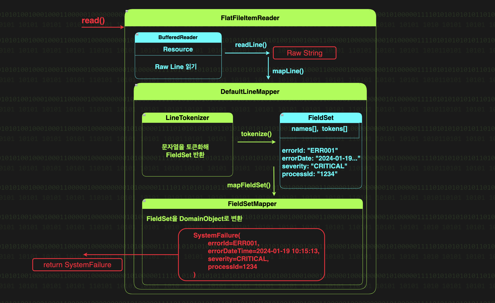

# FlatFileItemReader
- 플랫 파일(CSV, TSV)로 부터 데이터를 읽어온다.
  

### FlatFileItemReader의 내부
1. 파일에서 한 줄을 읽는다.
2. 읽어온 한 줄의 문자열을 우리가 사용할 객체로 변환해 사용한다. Like JDBC의 RowMapper처럼
   - LineMapper 가 파일의 한 줄을 우리가 사용할 객체로 변환을 담당
- 우리는 `DefaultLineMapper` 라는 Batch가 제공하는 기본 구현체를 쓰면 된다.

### DefaultLineMapper의 내부
- 동작은 크게 토큰화와 객체 매핑 2가지로 분리된다. 

#### 토큰화
- LineTokenizer 구현체 2가지가 있다.
  - DelimitedLineTokenizer: 구분자로 구분된 형식의 라인을 토큰화
  - FixedLengthTokenizer: 고징 길이로 구분된 데이터를 토큰화
- 토큰화 결과인 FieldSet의 프로퍼티 2가지
  - String[] tokens: 토큰화된 데이터 배열
  - List<String> names: 각 토큰이 매핑될 객체의 프로퍼티 이름 목록
- RegexLineTokenizer

#### 객체 매핑
- FieldSet을 객체로 매핑하는 FieldSetMapper
  - BeanWrapperFieldSetMapper(기본값): 객체의 setter 필수
  - custom한 FieldSetMapper 사용할 경우 `targetType()` 사용 X
---

### PatternMatchingCompositeLineMapper
- Ant 스타일의 패턴 매칭을 지원해, 각 라인의 패턴("ERROR*", "ABORT*" ...) 에 따라 서로 다른 
LineTokenizer 와 FieldSetMapper 를 적용할 수 있다.

# FlatFileItemWriter
