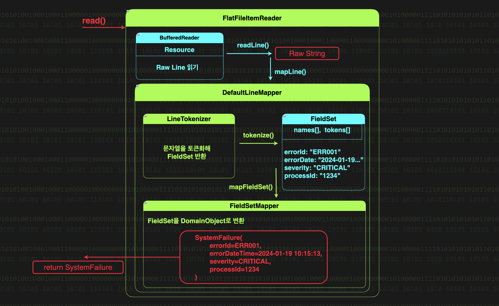
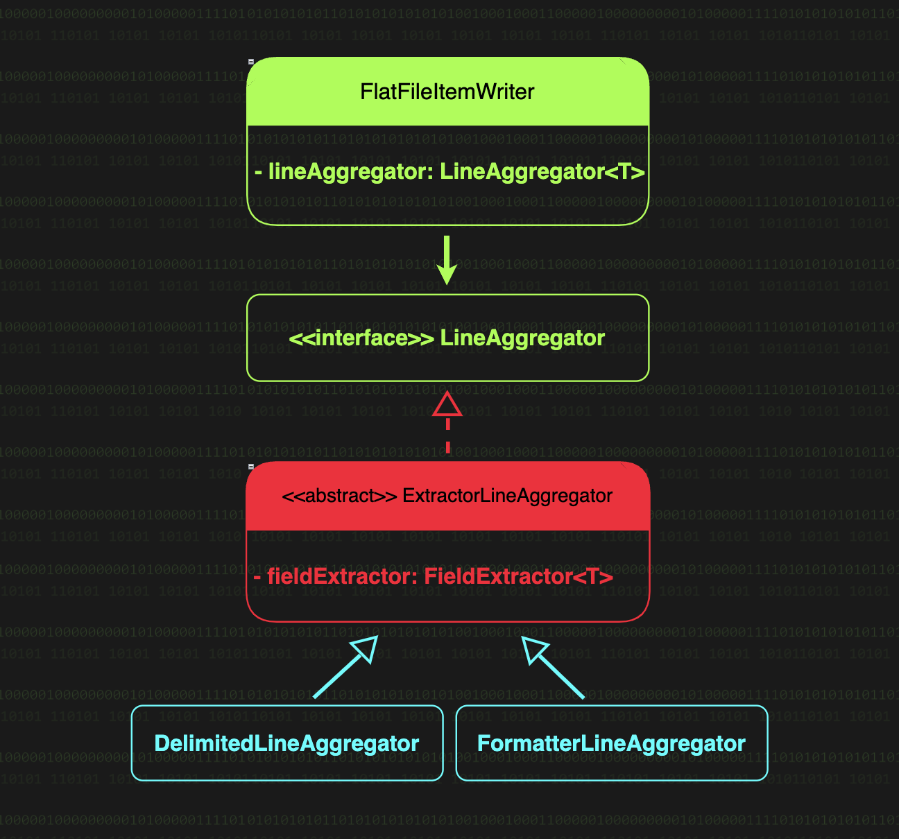
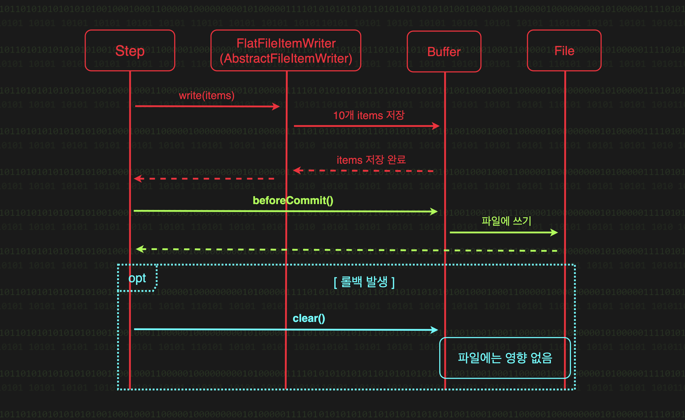

# FlatFileItemReader
- 플랫 파일(CSV, TSV)로 부터 데이터를 읽어온다.
  

### FlatFileItemReader의 내부
1. 파일에서 한 줄을 읽는다.
2. 읽어온 한 줄의 문자열을 우리가 사용할 객체로 변환해 사용한다. Like JDBC의 RowMapper처럼
   - LineMapper 가 파일의 한 줄을 우리가 사용할 객체로 변환을 담당
- 우리는 `DefaultLineMapper` 라는 Batch가 제공하는 기본 구현체를 쓰면 된다.

### DefaultLineMapper의 내부
- 동작은 크게 토큰화와 객체 매핑 2가지로 분리된다. 

#### 토큰화
- LineTokenizer 구현체 2가지가 있다.
  - DelimitedLineTokenizer: 구분자로 구분된 형식의 라인을 토큰화
  - FixedLengthTokenizer: 고징 길이로 구분된 데이터를 토큰화
- 토큰화 결과인 FieldSet의 프로퍼티 2가지
  - String[] tokens: 토큰화된 데이터 배열
  - List<String> names: 각 토큰이 매핑될 객체의 프로퍼티 이름 목록
- RegexLineTokenizer

#### 객체 매핑
- FieldSet을 객체로 매핑하는 FieldSetMapper
  - BeanWrapperFieldSetMapper(기본값): 객체의 setter 필수
  - custom한 FieldSetMapper 사용할 경우 `targetType()` 사용 X
  - `targetType()` 에 record 전달 시, RecordFieldSetMapper 가 사용됨
---

### PatternMatchingCompositeLineMapper: 한 파일의 라인이 각자의 패턴을 가지고 있을 때 사용 
- Ant 스타일의 패턴 매칭을 지원해, 각 라인의 패턴("ERROR*", "ABORT*" ...) 에 따라 서로 다른 
LineTokenizer 와 FieldSetMapper 를 적용할 수 있다.

### MultiResourceItemReader: 여러 파일을 순차적으로 읽기
- 실제 파일을 읽어들일 위임 대상
- 읽어들일 파일들의 목록

# FlatFileItemWriter
- `필드 추출`과 `문자열 결합` 으로 도메인 객체를 파일에 기록한다.
  - FieldExtractor: 필드 추출
  - LineAggregator: 추출한 필드 값들을 문자열로 결합

## 내부 동작
### FieldExtractor
- sourceType 에 따라 아래 2가지 중 자동으로 선택
  - BeanWrapperFieldExtractor: Java Bean 객체로부터 필드를 추출, getter 기반
  - RecordFieldExtractor: Java Record 객체에서 필드 추출, 레코드 컴포넌트의 accessor 메서드 호출

### LineAggregator
- DelimitedLineAggregator: 구분자 기반 형식으로 파일 쓸 때
- FormatterLineAggregator: 고정 길이 형식 포함한 다른 형식으로 파일 쓸 때

### custome FieldExtractor
- sourceType 과 names()는 무시된다.

## 존재하는 파일 처리 옵션
- shouldDeleteIfExists: 기존 파일의 삭제 여부(기본값: true)
- append: 기존 파일에 데이터 덧붙이기 여부(기본값: false, 값을 true로 설정할 경우, shouldDeleteIfExists는 자동으로 false 로 설정)
- shouldDeleteIfEmpty: 빈 결과 파일 처리 여부(기본값 false)
  - 단, 빈 파일 여부는 현재 스텝에서 FlatFileItemWriter 가 실제로 쓴 라인 수를 기준.
    - 만약, append가 true 고 shouldDeleteIfEmpty 도 true 일 때, 현재 스텝에서 아무 데이터도 쓰지 않으면 파일이 삭제되니 주의

## 롤백 전략
- 청크 처리가 완료되어 트랜잭션이 커밋되려고 할 때, 즉 `beforeCommit()` 콜백이 호출될 때, 버퍼 데이터를 파일에 쓴다.
- trasactional() 메소드로 설정가능하며, 기본값 true

## OS 레벨의 파일 처리
- forceSync(true): OS가 캐시가 아닌 디스크에 즉시 동기화되어 OS 중단이나 파일 시스템 발생해도 데이터 손실 위험이 줄어든다.
  - 기본값은 false 이다.

## 대용량 파일의 분할 처리: MultiResourceItemWriter
- 여러 개의 리소스(파일)에 데이터를 분배하는 ItemWriter 구현체
- 